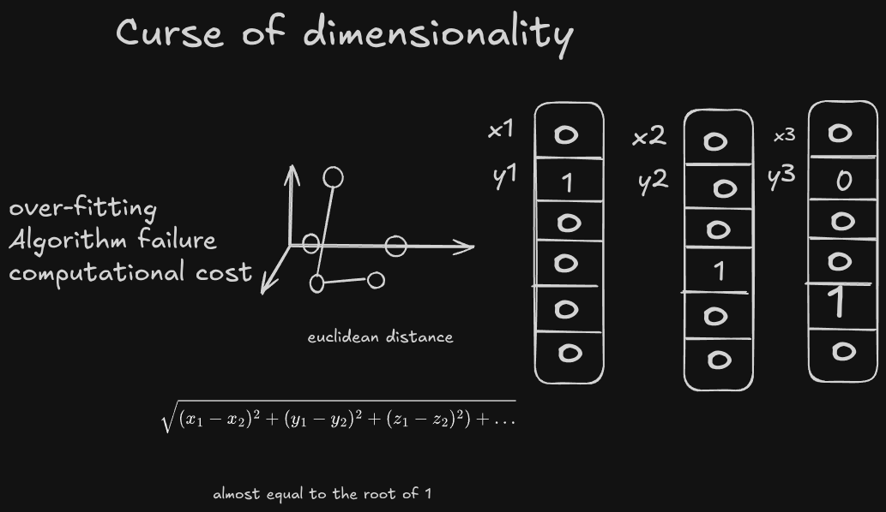
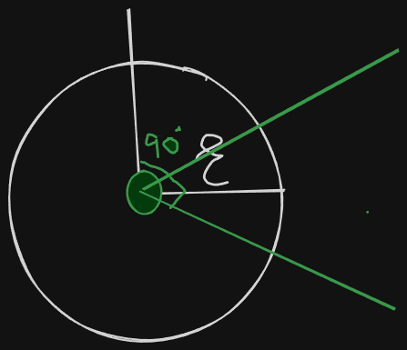
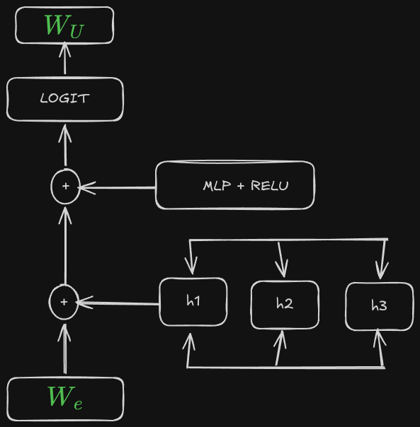
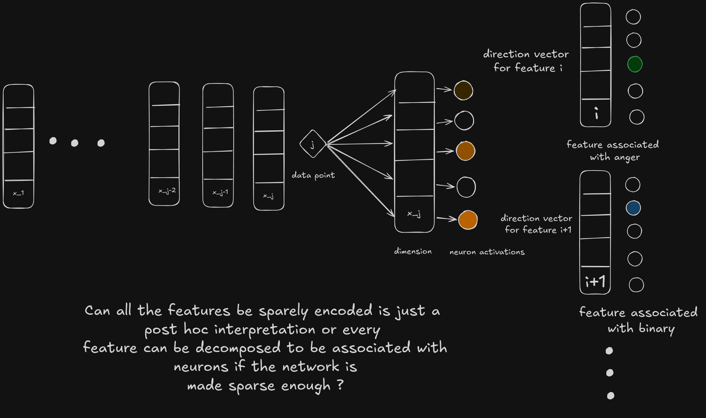

In the previous sections we have seen the phenomenon of superposition.  We have seen both the positive and negative effects of the superposition.

As the dimensions of the features grows larger sparsity grows rapidly, distances become less informative. 

the volume of the latent space grows larger exponentially. The internal states cannot be understood unless they are decomposed into independent components. 

The meaning of the concept of local neighborhood $\epsilon$ becomes less informative. It becomes a lot more interpretable when it is just one layer attention only models but as the size grows and MLP block is added it becomes almost impossible  to break it down into interpretable features. 

So the natural question arises. How do we approach breaking down the MLP block into to understand what goes inside the model. 

In the previous sections we have covered simpler architectures with one or 2 layers and looked at induction heads inside the [transformers](https://factity.github.io/safe-ai/interp_test) .  we have exclusively focused on the attention blocks we broke them down into one layer attention blocks, two layer attention blocks and looked at how bigram statistics emerged. When it comes to MLP block it becomes impossible to break them down in this structure because the MLP is an actual traditional neural net. All parts of the layers matter to put this simply if we just took one layer depth the model will not predict well. we need all the different layers to get the needed performance to make a more accurate prediction. Fortunately traditional neural nets have established frameworks for interpretability and large body of work for all types like CNN's, RNN's, GAN's etc. 

Our objective is to break down the MLP block and understand which of the following concepts will be associated with neurons. so we map $\mathbf{x}^j$ with different activation's in the layer. 

$$
\mathbf{x}^j \approx \mathbf{b} + \sum_i f_i(\mathbf{x}^j) \mathbf{d}_i
$$

![[Pasted image 20260723073804.png|510]]

Here $d_{i}$ is a unique term which is associated with a direction in the feature space. This process is called linear vector factorization. Each direction is associated with a concept.  To understand the activation we train a sparse autoencoder on the activation layer 

$$
f_i(x) = \text{ReLU}( W_e (\mathbf{x} - \mathbf{b}_d) + \mathbf{b}_e )_i,
$$

where $W_e$is the weight matrix of the encoder and $\mathbf{b}_d, \mathbf{b}_e$ are a pre-encoder and an encoder bias. The feature directions are the columns of the decoder weight matrix $W_d$  . 

From the above section on superposition we have seen that neurons try to represent more features essentially forming an over complete basis. To decompose the activation layer using the sparse encoder and to interpret the results. we need to make sure the following are satisfied. 

1.  We should have a clear understanding of which of the following inputs leads to the activations that is required. This property is related with the Causality, generality, and purity and help us grasp which property activate a specific instance 

2. The down stream layers pass down the effects of perturbations made. Suppose we make a simple change in the upper layer the changes will be reflected in the sub subsequent layers.

3. features explain significant portion of the functionality of the MLP 

If we were able to satisfy the following criteria then we can:

-  Determine how much of the feature changes the output and the next layer activations. 
- Monitor the network for the activations of a specific layer 
- Trickle down effect is observed i.e, changing the upper layers changes the downstream layers 
- The network actually works i.e, that is the network is able to approximate the data 
- The data is actually influencing the output 
- Design inputs that will trigger an activation [^1]

	Even if we were able to remove the superposition completely we still observe superposition any amount of architectural changes does not guarantee the complete removal. Let us suppose we took a single neuron with 4 different mutually exclusive features and one hot encoded them to eliminate any form of overlap A/B/C/D we still observe superposition from just the inherent nature of mutual exclusivity. The preference score incentivize  the model to acquire superposition  thereby reducing the loss.

![[Pasted image 20260723090450.png]]

superposition shows that large set of sparse features could be represented in the lower dimensional space.  Natural latent variables are sparse and we are trying to map higher dimensional vector from a lower dimensional projection. Although greedy methods can be approximated well but sparse auto encoders works well just because of the scalability.  sparse auto encoders can be grown to approximate any large data sets. 

![[Pasted image 20260723105729.png]]

The sparse encoder we have designed has a linear layer attached to the encoder block with ReLU activation function and a decoder block with another linear layer and a decoder block.   
The best factorization is the one that minimizes the total information of autoencoder  and the data 

importance of the scale . training models on larger amounts of data has shown to form more sharper boundaries and increase the expressivety 

Some of the neurons while training does not activate and appear to be dead by resampling we can rejuvenate the dead neuron. After these are done the most subsequent logical step is to 
measuring the performance of the autoencoder. we can understand how these work either by manually check to look for patterns, by analyzing  feature density finding on which of the following tokens the model fires, by looking at the MSE loss on how accurately these map the MlP etc. 

advantages of using a one layer model 

-  Fewer features to represent i.e, have the ability to cover all the features using the dictionary we are using.
- we have the ability to train the models quite cheaply. higher number of training tokens will allow models cleaner representations 
- Because of the linearity. we can easily analyze the logit outputs and we have also shown that the properties generalize in multilayer models. We would have the opportunity to analyze not just the data distribution but also the functionality of the model. 

///////////////////////////////////////////////////////////////////////////////////////////////////////////////////

rough draft of what will be happening we will be changing it in the subsequent sections the numbering scheme based on the experiments we will be carrying out 

what are the parameters we will be keeping in mind 

--> find the model from which the features have originated 
--> learned factors and L1 coefficients  used 
--> final correspond to the final feature in the run 

![[Pasted image 20260723160055.png]]

interface for explaining the features 

/////////////////////////////////////////////////////////////////////////////////////////////////////////////////////

investigation of the individual features and some of the findings 

text written in Arabic | DNA sequences | base 64 strings | text written in Hebrew

the following will be established for the learned features 

-  the leaned feature activates with high specificity for the hypothesized context 
- the learned feature activates with high sensitivity for the hypothesized context
- the learned feature causes appropriate downstream behavior  
- the learned feature does not correspond to a neuron 
- the learned feature is universal 

![[Pasted image 20260723164424.png|697]]

after the experiments are done list the ones that you have observed about which of the activations caused what explore the following

select a bunch of characteristics and do the following each for the selected characteristic
1. Activation specificity 
2. Activation sensitivity 
3. downstream effects 
4. feature is not a neuron 
5. universality 

//////////////////////////////////////////////////////////////////////////////////////////////////////////////////////

### Global analysis 

In the above section we have associated particular features with the associated activations in this section we will be looking at the overall picture. 

//////////////////////////////////////////////////////////////////////////////////////////////////////////////////////
note the number of features the selected model with the fixed L1 will display 
find how many of them are dead or ultra low dense and display atypical properties 

Looking at the typical feature and how interpretable it is 

human analysis and two automated methods of interpretability 

### feature types 

After modeling we found context features and token in context features. 

theoretical outlook of the transformer takes two inputs and produces a output 

n token conjugations in the MLP blocks 

token in context feature the word  **the** has been activated in 100 different features in different contexts 

|                   | Transformer | sparse autoencoder |
| ----------------- | ----------- | ------------------ |
| layers            |             |                    |
| neurons           |             |                    |
| dataset           |             |                    |
| loss              |             |                    |
| number of weights |             |                    |
| algorithm         |             |                    |

#### key takeaways 

-  Sparse autoencoders extract relatively mono semantic features. 
- Spare autoencoders produce features that are not readily associated with the neuron basis 
- When the patterns are associated with the autoencoders we can trigger it to generate specific generations 
- The features found with the auto encoders are universal 
- The wider the size of the auto encoder the more our ability to capture more concepts more fine grained structure 
- relatively small number of neurons can represent complex concepts 
- generate finite state automata diagrams for what is happening 

t